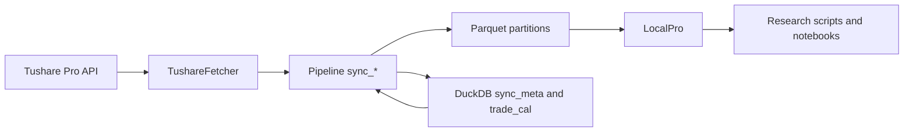

# Tushare 数据扩展设计

## 背景

`zer0share` 当前已经接入了少量但关键的 Tushare 数据：

- `trade_cal`：交易日历
- `basic`：股票基础信息
- `daily_kline`：A 股日线行情
- `adj_factor`：复权因子

这几类数据可以支撑基础行情查询和本地 `pro_bar`，但如果要做更完整的量化研究、财务分析、资金流分析或日常选股，还需要继续接入更多 Tushare 接口。后续扩展不应为每张表临时拼代码，而应沉淀一套稳定流程：从接口选择、同步策略、Parquet 存储，到本地 Tushare-like API 查询，都按同一规范推进。

本文档定义后续接入更多 Tushare 数据的设计原则和落地步骤。

## 目标

- 支持持续接入更多 Tushare 数据，并保存为本地 Parquet 数据集。
- 通过 DuckDB 查询本地 Parquet，继续提供类似 Tushare Pro 的 `pro_api()` 使用体验。
- 为不同更新频率的数据设计统一的同步策略，减少重复代码。
- 明确目录、字段、日期、增量、错误处理和测试规范。
- 让后续新增一个数据接口时，有清晰的开发清单和验收标准。

## 非目标

- 本文档不实现具体新接口。
- 本文档不改变现有 `trade_cal`、`basic`、`daily_kline`、`adj_factor` 的行为。
- 本文档不保存任何 Token、Webhook Key 或本机私密路径。
- 本文档不要求完整复刻 Tushare 的所有接口参数，只要求优先对齐常用查询方式。

## 当前架构

当前数据链路可以理解为：



核心职责如下：

- `zer0share/fetcher.py`：封装 Tushare SDK 调用，声明字段列表，做基础类型转换。
- `zer0share/pipeline.py`：编排同步流程，处理增量、交易日遍历、失败告警和同步进度。
- `zer0share/storage.py`：负责 Parquet 写入、分区路径、DuckDB 元数据。
- `zer0share/api.py`：提供本地 `LocalPro` 查询方法，通过 DuckDB 读取 Parquet 并返回 `pandas.DataFrame`。
- `zer0share/cli.py`：暴露 `sync`、`status`、`scheduler` 等命令。
- `tests/`：验证每一层行为，避免后续扩展破坏已有接口。

## 数据接入分层

不同 Tushare 接口的更新规律不同，不能全部套用同一种同步方法。新增接口前，先把数据归入以下类型。

### 1. 快照型数据

特点：每次接口返回的是当前完整状态，通常可以整表覆盖。

示例：

- `stock_basic`
- `namechange`
- `new_share`
- `stock_company`
- `stk_managers`
- `stk_rewards`

推荐存储：

```text
data/<table_name>/data.parquet
```

推荐同步：

- 每次拉全量。
- 成功写入后更新 `sync_meta.last_date = today`。
- 写入采用覆盖语义，避免旧记录残留。

适用场景：基础资料、公司资料、人员信息、股本事件等。

### 2. 交易日增量型数据

特点：按交易日更新，最适合复用现有 `daily_kline` 和 `adj_factor` 的模式。

示例：

- `daily`
- `adj_factor`
- `daily_basic`
- `moneyflow`
- `stk_limit`
- `limit_list_d`
- `ggt_daily`
- `ggt_monthly`（如果按交易日或月份处理，需要单独判断）

推荐存储：

```text
data/<table_name>/date=YYYYMMDD/data.parquet
```

推荐同步：

- 依赖 `trade_cal` 中的 SSE 开市日。
- 默认从 `sync_meta.last_date + 1` 开始，没有历史则从项目定义的起始日开始。
- 每个交易日调用一次 Tushare。
- 如果分区文件已存在，则跳过。
- 每成功写入一个新交易日，就推进 `sync_meta.last_date`。
- 接口失败时中止本次任务，并发送通知。

适用场景：行情、估值、资金流、涨跌停、龙虎榜等日频数据。

### 3. 报告期型数据

特点：以财报报告期为主，数据存在披露滞后和修订，不能简单按交易日处理。

示例：

- `income`
- `balancesheet`
- `cashflow`
- `fina_indicator`
- `fina_audit`
- `fina_mainbz`
- `forecast`
- `express`
- `dividend`

推荐存储：

```text
data/<table_name>/period=YYYYMMDD/data.parquet
```

或在需要保留公告日维度时：

```text
data/<table_name>/ann_date=YYYYMMDD/data.parquet
```

推荐同步：

- 首次同步：遍历常见报告期，例如 `20160331`、`20160630`、`20160930`、`20161231` 至今。
- 日常同步：以最近若干报告期为窗口反复刷新，例如最近 8 个季度。
- 财务数据可能修订，不建议只拉一次后永久跳过。
- 同步进度不能只依赖单一 `last_date`，建议记录 `last_period`，并对近期开窗覆盖。

适用场景：基本面、财报因子、估值模型。

### 4. 股票维度型数据

特点：接口常以 `ts_code` 为主要参数，按单只股票拉取更稳定。

示例：

- `suspend_d`
- `bak_daily`（视接口限制而定）
- 某些公司行动、股东户数、十大股东类接口

推荐存储：

```text
data/<table_name>/ts_code=000001.SZ/data.parquet
```

或时间跨度很长时：

```text
data/<table_name>/ts_code=000001.SZ/year=2024/data.parquet
```

推荐同步：

- 股票列表来自本地 `basic`。
- 对每个 `ts_code` 拉取数据。
- 对高频变化数据，按日期窗口增量；对低频资料，按固定周期刷新。
- 需要限制并发和请求频率，避免触发 Tushare 限流。

适用场景：以个股为中心的低频资料。

### 5. 低频专题型数据

特点：数据量通常不大，但接口语义差异较大。

示例：

- 指数基础信息
- 行业、概念、成分股
- ETF/基金基础资料
- 宏观数据

推荐存储：

```text
data/<domain>/<table_name>/data.parquet
```

或：

```text
data/<table_name>/data.parquet
```

推荐同步：

- 优先按全量覆盖。
- 如果接口有日期参数，再按月、季度或年份增量。
- 本地 API 可以按领域逐步暴露，不必一次性全部补齐。

## 端到端接入流程

新增一个 Tushare 接口时，建议按以下顺序开发。

### 第一步：定义数据规格

为每张新表建立一份规格，至少包含：

- 本地表名，例如 `daily_basic`。
- Tushare 接口名，例如 `daily_basic`。
- 字段列表，例如 `DAILY_BASIC_COLS`。
- 主键或自然唯一键，例如 `ts_code + trade_date`。
- 日期列，例如 `trade_date`、`ann_date`、`period`。
- 分区策略，例如 `date=YYYYMMDD`。
- 同步类型：快照型、交易日增量型、报告期型、股票维度型或低频专题型。
- 本地 API 方法名和常用参数。

建议在代码中集中保存字段常量，延续当前 `BASIC_COLS`、`DAILY_COLS`、`ADJ_FACTOR_COLS` 的风格。

### 第二步：扩展 Fetcher

在 `TushareFetcher` 中新增 `fetch_<table_name>()` 方法。

要求：

- 只负责调用 Tushare、指定字段、处理空返回、转换日期类型。
- 不写文件，不更新同步进度。
- Tushare 返回 `None` 或空表时，返回带正确列名的空 `DataFrame`。
- 日期列在内部统一转为 Python `date`，本地 API 输出时再转回 `YYYYMMDD` 字符串。
- 字段顺序必须和字段常量一致。

示意：

```python
def fetch_daily_basic(self, trade_date: date) -> pd.DataFrame:
    date_str = trade_date.strftime("%Y%m%d")
    df = self._pro.daily_basic(trade_date=date_str, fields=",".join(DAILY_BASIC_COLS))
    if df is None or df.empty:
        return pd.DataFrame(columns=DAILY_BASIC_COLS)
    df["trade_date"] = pd.to_datetime(df["trade_date"], format="%Y%m%d").dt.date
    return df[DAILY_BASIC_COLS]
```

### 第三步：扩展 Storage

在 `storage.py` 中新增写入、读取和分区存在判断。

交易日增量型数据建议使用统一模式：

```text
data/<table_name>/date=YYYYMMDD/data.parquet
```

需要的函数：

- `write_<table_name>(data_dir, partition_key, df)`
- `<table_name>_partition_exists(data_dir, partition_key)`
- 必要时增加 `read_<table_name>()`

后续可以进一步抽象通用函数，例如：

- `write_partitioned_table(data_dir, table_name, partition_name, partition_value, df)`
- `partition_exists(data_dir, table_name, partition_name, partition_value)`

但在接入少量表时，也可以先保持显式函数，便于测试和阅读。

### 第四步：扩展 Pipeline

在 `Pipeline` 中新增 `sync_<table_name>()`。

不同类型采用不同模板：

- 快照型：拉全量，覆盖写入，更新 `sync_meta` 为今天。
- 交易日增量型：复用 `get_trading_days("SSE", start, end)`，逐日拉取。
- 报告期型：遍历报告期，近期窗口覆盖刷新。
- 股票维度型：从 `basic` 获取股票池，按 `ts_code` 拉取。
- 低频专题型：按接口特点全量或低频增量。

交易日增量型应延续当前语义：

- 无 `start_date` 时，从 `sync_meta.last_date + 1` 开始。
- 有 `start_date` 时，按用户指定范围补数。
- 已存在分区跳过。
- 每次成功写入后推进同步进度。
- 失败时记录日志、发送告警并抛出异常。

### 第五步：扩展 CLI

在 `zer0share/cli.py` 中：

- 将新表名加入 `sync --table` 的选择范围。
- 在 `sync --all` 中安排合理顺序。
- 在 `status` 中展示新表同步进度。

推荐顺序：

1. `trade_cal`
1. 快照型基础数据
1. 交易日增量型行情和指标
1. 报告期型财务数据
1. 股票维度和专题数据

如果某些接口成本高或权限要求高，不应默认放入 `sync --all`，可以单独提供 `sync --table`。

### 第六步：扩展本地 API

在 `LocalPro` 中新增同名或近似同名方法，例如：

```python
def daily_basic(
    self,
    ts_code: str | None = None,
    trade_date: str | None = None,
    start_date: str | None = None,
    end_date: str | None = None,
    fields: str | list[str] | None = None,
) -> pd.DataFrame:
    ...
```

要求：

- 方法名尽量与 Tushare 接口一致。
- 常用参数名尽量与 Tushare 一致。
- 支持 `fields` 字段投影。
- 日期输入接受 `YYYYMMDD`。
- 日期输出返回 `YYYYMMDD` 字符串，贴近 Tushare 使用习惯。
- 合法但无匹配结果时返回空 `DataFrame`。
- 本地数据集不存在时抛出带同步提示的 `FileNotFoundError`。
- 将新增方法加入 `query()` 分发表。

对日分区数据，应优先复用 `_query_daily_partitioned()` 或抽象出更通用的 `_query_date_partitioned()`。

### 第七步：补充测试

每新增一类数据，至少补以下测试：

- `tests/test_fetcher.py`：验证 Tushare 调用参数、字段列表、空数据、日期转换。
- `tests/test_storage.py`：验证 Parquet 路径、写入读取、分区存在判断。
- `tests/test_pipeline.py`：验证增量逻辑、跳过已存在分区、失败告警、同步进度推进。
- `tests/test_api.py`：验证本地查询过滤、字段投影、日期格式、缺数据错误。
- `tests/test_cli.py`：验证新 `sync --table` 参数可用，非法日期范围仍有提示。

## 存储规范

### 命名

- 本地表名使用小写蛇形命名，例如 `daily_basic`。
- 尽量与 Tushare 接口名一致。
- 如果已有项目命名不同，例如 `daily` 存为 `daily_kline`，应在文档和 API 中明确映射。

### 分区

推荐分区规则：

| 数据类型     | 推荐目录                                             |
| ------------ | ---------------------------------------------------- |
| 快照型       | `data/<table>/data.parquet`                          |
| 交易日增量型 | `data/<table>/date=YYYYMMDD/data.parquet`            |
| 报告期型     | `data/<table>/period=YYYYMMDD/data.parquet`          |
| 公告日型     | `data/<table>/ann_date=YYYYMMDD/data.parquet`        |
| 股票维度型   | `data/<table>/ts_code=<code>/data.parquet`           |
| 股票 + 年份  | `data/<table>/ts_code=<code>/year=YYYY/data.parquet` |

### 字段类型

- 日期列在写入 Parquet 前使用 `date` 类型。
- 数值列保留 Tushare 返回的数值类型，不强制转字符串。
- 股票代码、交易所、市场、状态等标识字段使用字符串。
- 布尔语义字段可以转为 `bool`，例如现有 `trade_cal.is_open`。

### 空数据

- Fetcher 层返回带列名的空 `DataFrame`。
- Pipeline 层遇到空表时可以不写分区，但需要谨慎处理同步进度。
- 如果某个交易日接口稳定返回空，仍可能需要记录“已处理”状态，避免每日重复请求。后续可增加 `sync_partitions` 元数据表记录空分区。

### 覆盖与幂等

- 快照型数据每次覆盖写入。
- 交易日分区数据默认分区存在即跳过。
- 财务报告期数据允许近期分区覆盖刷新。
- 任何同步任务重复执行，都不应产生重复数据。

## 同步规范

### 起始日期

当前项目使用 `FIRST_DATE = 2016-01-01` 作为日频数据默认起点。新增交易日增量型接口可以沿用该默认值，也可以按接口可用历史单独定义起点。

建议后续引入数据规格配置：

```python
DATASET_SPECS = {
    "daily_basic": {
        "api": "daily_basic",
        "sync_type": "trading_day",
        "start_date": date(2016, 1, 1),
        "partition": "date",
    },
}
```

### 交易日来源

- A 股日频数据默认使用 `SSE` 交易日历。
- 接入港股、期货、基金等数据时，需要确认是否仍可使用 SSE 日历。
- 如果交易日历不适用，应为该领域建立独立日历或按接口返回自然日期处理。

### 请求频率

- 当前日频同步每次请求后 `sleep(0.2)`。
- 新接口应根据 Tushare 权限和接口限频调整等待时间。
- 不建议一开始引入复杂并发；优先保证稳定和可恢复。

### 失败处理

- 单个分区失败时，记录明确日志。
- 若通知器开启，发送失败通知。
- 抛出异常中止任务，避免同步进度错误推进。
- 允许用户再次运行同一命令，从失败位置附近继续补数。

### 同步进度

现有 `sync_meta` 只有：

- `table_name`
- `last_date`
- `updated_at`

它适合日频线性增量，但对财务报告期、股票维度同步不够精细。后续可以增加更通用的分区级元数据表：

```sql
CREATE TABLE sync_partitions (
    table_name VARCHAR,
    partition_key VARCHAR,
    partition_value VARCHAR,
    status VARCHAR,
    row_count BIGINT,
    updated_at TIMESTAMP,
    PRIMARY KEY (table_name, partition_key, partition_value)
);
```

这样可以记录：

- 哪个分区成功同步。
- 哪个分区为空。
- 哪个分区失败。
- 每个分区有多少行。

## 本地 API 规范

### 方法命名

- 优先与 Tushare API 同名，例如 `daily_basic()`。
- 当前特殊映射要保留兼容，例如本地目录 `daily_kline` 对外方法仍是 `daily()`。

### 参数

第一阶段优先支持常用参数：

- `ts_code`
- `trade_date`
- `start_date`
- `end_date`
- `ann_date`
- `period`
- `fields`

对于 Tushare 中较少使用或复杂的参数，可以后续补充。

### 字段投影

- 所有本地 API 都应支持 `fields`。
- `fields` 可以是逗号字符串或字符串列表。
- 请求未知字段时抛出 `ValueError`。
- 字段顺序按用户请求或默认字段常量返回。

### 日期格式

- 用户输入日期使用 `YYYYMMDD`。
- 本地内部存储使用 `date`。
- 返回给用户的 DataFrame 日期列使用 `YYYYMMDD` 字符串。

### 查询实现

- 使用 DuckDB 的 `read_parquet()`。
- 对 Hive 分区目录使用 `hive_partitioning=true`。
- 查询条件必须参数化，避免拼接用户输入值。
- 对大表优先按分区过滤，避免扫描全部数据。

### `query()` 分发

每新增一个本地方法，都应加入：

```python
dispatch = {
    "daily_basic": self.daily_basic,
}
```

这样用户可以继续使用：

```python
pro.query("daily_basic", ts_code="000001.SZ", start_date="20240101", end_date="20240131")
```

## 配置、CLI 与调度

### 配置

当前 Token 已改为从 `TUSHARE_TOKEN` 环境变量读取。新增数据接口不应把 Token 或密钥写入配置文件。

如果接口需要特殊配置，可以新增非敏感字段，例如：

```toml
[sync]
request_sleep_seconds = 0.2
financial_refresh_quarters = 8
```

### CLI

新增表后，需要更新：

- `sync --table` 可选值。
- `sync --all` 的执行顺序。
- `status` 输出。

对高成本接口，建议不默认加入 `sync --all`，而是提供单独命令。

### 调度

如果继续使用项目内 APScheduler：

- 日频行情类可安排在收盘后。
- 财务类可每天低频刷新最近报告期。
- 快照型基础数据可每日或每周刷新。

如果使用 Windows 任务计划：

- 保证工作目录是项目根目录。
- 保证运行账户可以读取 `TUSHARE_TOKEN` 环境变量。
- 保证运行账户可以访问数据目录。

## 首批推荐接入清单

### 第一批：行情与估值增强

优先级最高，因为与现有日线和复权因子结构最接近。

| 本地表名       | Tushare 接口   | 类型         | 推荐分区        | 用途                                     |
| -------------- | -------------- | ------------ | --------------- | ---------------------------------------- |
| `daily_basic`  | `daily_basic`  | 交易日增量型 | `date=YYYYMMDD` | 换手率、市盈率、市净率、总市值、流通市值 |
| `moneyflow`    | `moneyflow`    | 交易日增量型 | `date=YYYYMMDD` | 个股资金流向                             |
| `stk_limit`    | `stk_limit`    | 交易日增量型 | `date=YYYYMMDD` | 每日涨跌停价                             |
| `limit_list_d` | `limit_list_d` | 交易日增量型 | `date=YYYYMMDD` | 涨跌停股票明细                           |

建议先实现 `daily_basic`，因为它和 `daily_kline` 最像，能验证通用日分区扩展是否合理。

### 第二批：财务报表与财务指标

| 本地表名         | Tushare 接口     | 类型     | 推荐分区          | 用途       |
| ---------------- | ---------------- | -------- | ----------------- | ---------- |
| `income`         | `income`         | 报告期型 | `period=YYYYMMDD` | 利润表     |
| `balancesheet`   | `balancesheet`   | 报告期型 | `period=YYYYMMDD` | 资产负债表 |
| `cashflow`       | `cashflow`       | 报告期型 | `period=YYYYMMDD` | 现金流量表 |
| `fina_indicator` | `fina_indicator` | 报告期型 | `period=YYYYMMDD` | 财务指标   |
| `fina_audit`     | `fina_audit`     | 报告期型 | `period=YYYYMMDD` | 审计意见   |

财务类需要重点处理“后续修订”，建议默认刷新最近 8 个季度。

### 第三批：公司行动与事件

| 本地表名    | Tushare 接口 | 类型            | 推荐分区            | 用途       |
| ----------- | ------------ | --------------- | ------------------- | ---------- |
| `dividend`  | `dividend`   | 报告期/公告日型 | `ann_date=YYYYMMDD` | 分红送转   |
| `forecast`  | `forecast`   | 报告期/公告日型 | `ann_date=YYYYMMDD` | 业绩预告   |
| `express`   | `express`    | 报告期/公告日型 | `ann_date=YYYYMMDD` | 业绩快报   |
| `suspend_d` | `suspend_d`  | 股票维度/日期型 | 视接口而定          | 停复牌信息 |

### 第四批：指数、行业与专题

| 本地表名         | Tushare 接口     | 类型         | 推荐分区                | 用途         |
| ---------------- | ---------------- | ------------ | ----------------------- | ------------ |
| `index_basic`    | `index_basic`    | 快照型       | `data.parquet`          | 指数基础信息 |
| `index_daily`    | `index_daily`    | 交易日增量型 | `date=YYYYMMDD`         | 指数日线     |
| `index_weight`   | `index_weight`   | 低频专题型   | `trade_date` 或 `month` | 指数成分权重 |
| `concept`        | `concept`        | 快照型       | `data.parquet`          | 概念分类     |
| `concept_detail` | `concept_detail` | 快照/专题型  | `data.parquet`          | 概念成分股   |

## 分阶段落地路线

### 阶段 1：抽象通用能力

目标：减少未来每接一张表都复制一遍代码。

建议任务：

- 抽象通用日分区写入和存在判断。
- 抽象通用日分区本地查询函数。
- 建立 `DATASET_SPECS` 或类似规格表。
- 为 `daily_basic` 写第一套端到端测试。

验收：

- `daily_basic` 可同步、可查询、可通过 `query("daily_basic")` 调用。
- 原有测试全部通过。

### 阶段 2：接入行情与估值类

目标：补齐日常选股最常用的日频数据。

建议顺序：

1. `daily_basic`
1. `stk_limit`
1. `limit_list_d`
1. `moneyflow`

验收：

- 每张表支持按 `ts_code`、`trade_date`、`start_date`、`end_date` 查询。
- 每张表支持 `fields`。
- `sync --table <name>` 可以单独补数。

### 阶段 3：接入财务类

目标：建立基本面研究所需的本地财务数据。

建议顺序：

1. `fina_indicator`
1. `income`
1. `balancesheet`
1. `cashflow`
1. `forecast`、`express`、`dividend`

验收：

- 支持按 `ts_code`、`period`、`ann_date` 查询。
- 最近若干报告期可以覆盖刷新。
- 文档说明财务数据修订风险。

### 阶段 4：接入指数与专题类

目标：补齐指数、行业、概念、基金等研究维度。

建议任务：

- 增加指数基础信息和指数日线。
- 增加指数成分权重。
- 增加概念分类和概念成分。
- 视需求扩展 ETF/基金数据。

验收：

- 可在本地 API 中完成常见指数和概念查询。
- 与 A 股个股数据在命名和日期格式上保持一致。

## 新增接口开发清单

接入每个新接口时，按此清单逐项完成：

- 在 `fetcher.py` 增加字段常量和 `fetch_*` 方法。
- 在 `storage.py` 增加写入、读取和分区判断，或复用通用函数。
- 在 `pipeline.py` 增加 `sync_*` 方法。
- 在 `cli.py` 增加 `sync --table`、`sync --all` 顺序和 `status`。
- 在 `api.py` 增加 `LocalPro` 方法和 `query()` 分发。
- 在 `README.md` 或专门文档中补充用户用法。
- 在 `tests/` 中补齐 fetcher、storage、pipeline、api、cli 测试。
- 运行 `uv run pytest`。

## 风险与注意事项

- Tushare 不同接口权限、积分和限频不同，新增接口前应先确认账号权限。
- 大体量数据不应盲目放进 `sync --all`，避免每日任务过慢或被限流。
- 财务数据存在修订，不能只用“分区存在即跳过”的思路。
- 股票维度接口容易产生大量请求，需要更谨慎地控制频率。
- 本地 API 查询大范围数据时要优先利用分区过滤，避免全表扫描。
- Token 必须来自环境变量 `TUSHARE_TOKEN`，不要写入文档或配置文件。